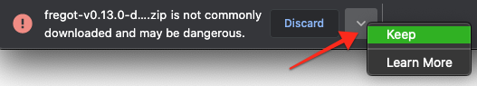

fregot
======

`fregot` (**F**ugue **Rego** **T**oolkit) is a set of tools for working with the
[Rego] policy language, which is part of the Open Policy Agent (OPA) policy
engine.  `fregot` allows you to easily evaluate expressions, debug code, test
policies, and more.

[(Check out the text-based demo on asciinema so you can copy/paste commands.)](https://asciinema.org/a/AfmqS0xB2g5ZuORW4siesYFRY?size=medium)

`fregot` can be seen an alternative REPL to [OPA]'s built-in interpreter.  The
goals are a little different -- whereas the OPA agent provides general-purpose
components and functionality that are particularly useful with Kubernetes,
`fregot` was developed internally at [Fugue] as a lightweight set of tools to
enhance the Rego development experience.  It aims to provide:

 -  Just the Rego language implementation rather than the full OPA agent
 -  Useful tools to debug Rego queries and modules
 -  Enhanced error messages
 -  Ease of extending and experimenting with different language features

You can use `fregot` to validate just about any kind of JSON or YAML against Rego
policy. For an example of using `fregot` to test a Terraform plan prior to
deployment, see the [Example Use Case](#example-use-case).

We are also actively working on improving the static analyzer to prevent many
kinds of bugs.

Table of Contents
--------------------

- [Installation](#installation)
	- [Binary - macOS](#binary---macos)
	- [Binary - Linux](#binary---linux)
	- [From source - any platform](#from-source---any-platform)
		- [Using stack](#using-stack)
		- [Using Cabal](#using-cabal)
- [Usage](#usage)
	- [fregot repl](#fregot-repl)
	- [fregot test](#fregot-test)
	- [fregot bundle](#fregot-bundle)
	- [fregot eval](#fregot-eval)
	- [fregot capabilities](#fregot-capabilities)
	- [Global options](#global-options)
- [REPL](#repl)
	- [The open package](#the-open-package)
	- [Debugging](#debugging)
		- [Step 1: Set breakpoint](#step-1-set-breakpoint)
		- [Step 2: Activate breakpoint](#step-2-activate-breakpoint)
		- [Step 3: Execute other debugging commands](#step-3-execute-other-debugging-commands)
- [REPL Usage](#repl-usage)
	- [:break](#break)
	- [:help](#help)
	- [:input](#input)
	- [:open](#open)
	- [:quit](#quit)
	- [:load](#load)
	- [:reload](#reload)
	- [:continue](#continue)
	- [:step](#step)
	- [:next](#next)
	- [:rewind](#rewind)
	- [:test](#test)
	- [:type](#type)
	- [:where](#where)
	- [:watch](#watch)
- [Example Use Case](#example-use-case)
- [macOS Installation Error Message](#macos-installation-error-message)
- [Additional Reading](#additional-reading)

Installation
------------

fregot works on all major platforms. Pre-built binaries are available for [macOS](#binary---macos) and [Linux](#binary---linux). All platforms, including Windows, support installing from [source](#from-source---any-platform).

### Binary - macOS

1. Navigate to [Releases] and download the **fregot-{version}-darwin-i386.zip** binary for the latest release.

  - Chrome users: If you see a message that the file "is not commonly downloaded
  and may be dangerous," select the arrow icon to the right and select "Keep."
  `fregot` is not dangerous.
  
  

2. Unzip the downloaded file.
3. `cd` into the `fregot-{version}-darwin-i386` directory you just unzipped.
4. Move the `fregot` binary to a location in your `$PATH`, such as `/usr/local/bin`:

       mv fregot /usr/local/bin
       
5. Run `fregot`:

       fregot

If you get an error message that the application cannot be opened, see [these instructions](#macos-installation-error-message).

### Binary - Linux

1. Navigate to [Releases] and download the **fregot-{version}-linux-x86_64.tar.gz** binary for the latest release.
2. Unzip the downloaded file.
3. `cd` into the `fregot-{version}-linux-x86_64` directory you just unzipped.
4. Move the `fregot` binary to a location in your `$PATH`, such as 
`/usr/local/bin`:

        sudo mv fregot /usr/local/bin

5. Run `fregot`:

        fregot

### From source - any platform

Installation through source is done using standard Haskell tooling -- [Cabal]
and [stack] both work well.

#### Using stack

1.  Install [stack] for your platform.
2.  Clone this repository and `cd` into it.
3.  Run `stack install`.
4.  Make sure `$HOME/.local/bin` is in your `$PATH`.

#### Using Cabal

1.  Install [Cabal] for your platform.
2.  Clone this repository and `cd` into it.
3.  Run `cabal install`.
4.  Make sure `$HOME/.cabal/bin` is in your `$PATH`.

Usage
-----

    fregot v0.13.0

    Usage: fregot COMMAND

    Available options:
      -h,--help                Show this help text
      --dump TAG               Dump debug information
      --format FORMAT          Format for error messages and diagnostics

    Available commands:
      repl                     Run fregot repl
      test                     Run tests in .rego files
      bundle                   Bundle .rego files
      eval                     Evaluate a rego expression
      capabilities             Print the capabilities document

`fregot` understands a number of subcommands and [global options](#global-options).  See details
and examples below.

### fregot repl

`fregot repl [PATHS] [--input PATH] [--watch]`: Start a REPL. Optionally, use
the `--input [PATH]` flag to specify [input](#input) and the `--watch` flag to
enable [watching files](#watch). See [working with the REPL](#repl) for details
and examples.

### fregot test

`fregot test [PATHS]`: Run tests.  `fregot` will recursively look for Rego files
in the given paths and run any rule starting with `test_`.

    Usage: fregot test PATHS
      Run tests in .rego files

    Available options:
      PATHS                    Rego files or directories to test

_Tip: You can run this command yourself from the root of this repo!_

This command runs all rules starting with `test_` in `ami_id.rego`:

    fregot test examples/ami_id/ami_id.rego

You'll see a count of passed, failed, and errored tests:

    passed: 2, failed: 0, errored: 0

Take a look at `examples/ami_id/ami_id.rego` to see test examples.

_Tip: You can also test Rego files from within the [REPL](#repl) using the
`:test` command. See [`:test`](#test) for details._

### fregot bundle

`fregot bundle [PATHS]`: Compile a number of Rego files into a single bundle
that can be loaded faster than individual files.  Experimental.  Note that we
currently use a different bundle format from [OPA].

    Usage: fregot bundle (-o|--output BUNDLE) PATHS
      Bundle .rego files

    Available options:
      -o,--output BUNDLE       Path of output file
      PATHS                    Rego files or directories to bundle

### fregot eval

`fregot eval [--input PATH] EXPRESSION [PATHS]`: Evaluate a Rego expression in a
policy file using a JSON file as input.

    Usage: fregot eval [-i|--input PATH] EXPRESSION [PATHS]
      Evaluate a rego expression

    Available options:
      -i,--input PATH          Input filepath
      EXPRESSION               Rego expression to evaluate
      PATHS                    Rego files or directories to load

_Tip: You can run this command yourself from the root of this repo!_

This command evaluates the `data.fregot.examples.ami_id.allow` expression from
`ami_id.rego` using the input file `repl_input.json`:

    fregot eval \
        --input examples/ami_id/repl_input.json \
        'data.fregot.examples.ami_id.allow' \
        examples/ami_id/ami_id.rego

You'll see the value of the expression in the output:

    [true]

Note that the expression argument should be formatted as `data.package.rule`
according to the package and rule name in the Rego file.

### fregot capabilities

`fregot capabilities`: Print the capabilities document. This document lists all
supported built-in functions with their arguments and types:

    {
      "builtins": [
        {
          "decl": {
            "args": [
              {
                "type": "number"
              }
            ],
            "result": {
              "type": "number"
            },
            "type": "function"
          },
          "name": "abs"
        },
        (etc.)

### Global options

`fregot` supports the following global options:

- `-h,--help` shows `fregot` help text
- `--dump TAG` is used to dump debug information
- `--format FORMAT` sets the format for error messages and diagnostics; values:
`text` or `json`
- `-v,--verbosity VALUE` determines how verbose `fregot` output is; values: `0`
(quiet) or `1` (default)

REPL
----

    F u g u e   R E G O   T o o l k i t
    fregot v0.13.0 repl - use :help for usage info
    repl% :help
    Enter an expression to evaluate it.
    Enter a rule to add it to the current package.

    Other commands:
      :break     Set or remove a breakpoint
      :help      show this info
      :input     set the input document
      :open      open a different package, e.g. `:open foo`
      :quit      exit the repl
      :load      load a rego file, e.g. `:load foo.rego`
      :reload    reload modified rego files
      :continue  continue running the debugged program
      :step      step (into) the next rule in the debugged program
      :next      step (over) the next rule in the debugged program
      :rewind    go back to the previous debug suspension
      :test      run tests in the current package
      :type      print the type of a term
      :where     print your location
      :watch     evaluate input after file changes

    Shortcuts are supported for commands, e.g., `:l` for `:load`.

The REPL is currently the most important part of `fregot`.  After loading the
files passed on the command line, you end up on an interactive prompt.

There are three ways to interact with the REPL:

 1. Entering a rule adds the rule to the currently open package, e.g.:

        repl% numbers = {4, 8, 15, 16, 23, 42}
        Rule numbers added

 2. Entering a query evaluates that query, e.g.:

        repl% numbers[n]; n % 2 == 0; n
        = 4
        | n = 4
        = 16
        | n = 16
        = 8
        | n = 8
        = 42
        | n = 42

 3. There are number of special commands that start with `:`.  Entering [`:help`](#help)
    shows you the full list of commands.

        repl% :quit

See [REPL Usage](#repl-usage) for details and examples for each command.

### The open package

The REPL has the concept of an open package, indicated by the prompt.  Initially
this is `repl`, but you can change this using [`:open`](#open).  For example,
we can add a rule to the package `foo` and change back to `repl`:

    repl% :open foo
    Warning: package foo contains no rules
    foo% a = 1
    Rule a added
    foo% :open repl
    repl% data.foo.a
    = 1

A typical workflow is to have an editor open as well as a `fregot repl`.  You
can then load the file using [`:load`](#load), which automatically opens the
package:

    repl% :load policy.rego
    Loading policy.rego...
    Loaded package policy
    policy%

Once you make changes to the file, just reload it using [`:reload`](#reload),
which reloads all modified Rego files.  If the file includes any rules starting
with `test_`, you can assess your changes using [`:test`](#test), like so:

    policy% :reload
    Reloaded policy.rego
    policy% :test
    passed: 1, failed: 0, errored: 0

### Debugging

Debugging generally follows these steps:

 1. Set one or more breakpoints with [`:break`](#break)
 2. Evaluate an expression that activates the breakpoint
 3. Use other debugging commands to [step into](#step), [step over](#next),
    [rewind](#rewind), [print location](#where), or [continue to the next
    breakpoint](#continue)

#### Step 1: Set breakpoint

You can start debugging by setting a breakpoint with [`:break`](#break) and then
evaluating something.

To set a breakpoint, use the `:break` command. The command below sets a
breakpoint on the rule `deny` in the currently loaded package,
`fregot.examples.demo`:

    fregot.examples.demo% :break deny
    Set breakpoint at fregot.examples.demo.deny

You can use the `:break` command
with either names, or a position in a file (line number).  For example:

    :break foo            # `foo` in the current package
    :break repl.foo       # `foo` in the package repl
    :break data.repl.foo  # Same as above
    :break foo.rego:9     # Line 9 of `foo.rego`

Once at least one breakpoint is set, you can use `:break` without arguments to
display the list. You'll see output like this:

    fregot.examples.demo.test_allow
    examples/demo/demo.rego:9
    fregot.examples.demo.deny

You can also use `:break` on an existing breakpoint to remove it again:

    fregot.examples.demo% :break deny
    Removed breakpoint at fregot.examples.demo.deny

#### Step 2: Activate breakpoint

Next, evaluate an expression that activates the breakpoint.  If the `repl`
package is already loaded and the breakpoint is set on `foo`, we can just
evaluate `foo`:

    %repl foo

#### Step 3: Execute other debugging commands

Once the breakpoint is activated, you end up in a _debugging context_.  From
here, you can do a number of things:

 -  Enter a query to evaluate in the _current context_: meaning that you can
    print and evaluate local variables that are in scope.
 -  Use [`:continue`](#continue) to continue to the next breakpoint.
 -  Use [`:step`](#step) and [`:next`](#next) to step into and over the next query,
    respectively.
 -  Use [`:rewind`](#rewind) to go _back_ to the last step.
 -  Use [`:where`](#where) to see your current location.
 -  Use [`:quit`](#quit) to exit debugging mode. Use `:quit` again to exit the REPL.

#### Debugging notes

 -  By default, `fregot` turns off optimizations when debugging.  This allows
    you to more naturally follow what the code is doing.  However, this may get
    in your way when trying to debug complex queries that take too long to
    execute without optimizations.

    To explicitly turn on optimizations (even while debugging), use
    `fregot repl -O`.

REPL Usage
----------

### :break

`:break [location]` sets a breakpoint.  For example, the command below sets a
breakpoint at the `allow` rule in the package `fregot.examples.ami_id`:

    repl% :break fregot.examples.ami_id.allow
    Set breakpoint at fregot.examples.ami_id.allow

To enter debugging mode, make sure you've loaded the package with [`:load`](#load), and
activate the breakpoint by entering the rule name:

    fregot.examples.ami_id% allow

The REPL displays the code at the breakpoint, along with the line number:

    fregot.examples.ami_id% allow
    23|     count(unapproved_amis) == 0
            ^^^^^^^^^^^^^^^^^^^^^^^^^^^

The REPL prompt then includes the word `debug`, allowing you to enter [other
debugging commands](#step-3-execute-other-debugging-commands):

    fregot.examples.ami_id(debug)%

Entering `:break` by itself displays a list of breakpoints:

    repl% :break

You'll see output like this:

    fregot.examples.ami_id.allow
    examples/ami_id/ami_id.rego:9

See [Step 1: Set breakpoint](#step-1-set-breakpoint) for more info.

#### Evaluating local variables

Once you've loaded a file, activated a breakpoint, and entered debugging mode,
you can evaluate queries in the current context -- including printing and
evaluating local variables.

For example, if you look at
[break_example.rego](./examples/break_example/break_example.rego), you'll see
that `function_a` has the local variable `a`:

    function_a {
      a = "Welcome to function a!"
      true
    }

If you load the Rego file and try to evaluate `a` without setting a breakpoint
first, you'll get an error message that the variable is not in scope:

    fregot.examples.break_example% a

    fregot (compile error):
      "a" (line 1, column 1):
      unknown variable:

        1| a
           ^

      Undefined variable: a

However, if you set a breakpoint at `function_a`, activate it, and
[`:step`](#step) into it, you can see the value of `a`:

    fregot.examples.break_example% :break function_a
    Set breakpoint at fregot.examples.break_example.function_a

    fregot.examples.break_example% function_a

    4|   a = "Welcome to function a!"
         ^^^^^^^^^^^^^^^^^^^^^^^^^^^^

    fregot.examples.break_example(debug)% :step

    5|   true
         ^^^^

    fregot.examples.break_example(debug)% a
    = "Welcome to function a!"

### :help

**Shortcut** `:h`

`:help` displays help text for the REPL. See [REPL](#repl) for more information.

### :input

While in the REPL, you can directly change the input document by using the
`:input` command to specify the path of your input document. Input can be
JSON or YAML.

For example, if you want to load the input in `example.json`, you would do this:

    repl% :input example.json

The command returns no output unless there is an error.

After you've set the input, you can enter `input` without colon or argument to
print the input document to the screen:

    repl% input
    = {"user": "alice"}

Two things to note:

 -  The home directory shortcut `~` is not currently supported, so use the
    absolute path instead; e.g., `/Users/alice/input.json`

 -  If you change the input document, make sure to update it by issuing the
    [`:reload`](#reload) command. (Or, if you've enabled [`--watch`](#watch) mode,
    the REPL will reload the changes automatically!)

You can also set the input when you start the REPL with the `--input PATH` flag:

    fregot repl examples/ami_id/ami_id.rego --input input.json

### :open

**Shortcut** `:o`

By default, you start in the `repl` package when you run `fregot repl`.  `:open`
allows you to switch between packages in files you've [loaded](#load). For
example, you can switch to `fregot.examples.ami_id` like so:

    repl% :open fregot.examples.ami_id

The REPL prompt changes to the name of the package you just loaded:

    fregot.examples.ami_id%

To change to another package (or return to the `repl` package), you can run
`:open [PACKAGE]`.

For more information, see [The open package](#the-open-package).

### :quit

**Shortcut** `:q`

`:quit` exits debugging mode if you're in debugging mode, and exits the REPL if
you're not:

    repl(debug)% :quit
    
    repl% :quit

### :load

**Shortcut** `:l`

`:load [PATH]` loads a Rego file and automatically opens the package. For
example:

    repl% :load examples/ami_id/ami_id.rego

You'll see output like this:

    Loaded package fregot.examples.ami_id

Once the file is loaded, you can debug it with [other commands](#repl-usage).
You can also enter rules or expressions to evaluate them.  For example, this
command returns the value of the rule `allow` in the loaded Rego file:

    fregot.examples.ami_id% allow

You'll see output like this:

    = true

Tip: You can skip the `:load` step by specifying the Rego file paths when you
start the REPL:

    fregot repl my_policy_1.rego my_policy_2.rego

Directories are searched recursively. This command opens all the Rego files in
the `examples` folder:

    fregot repl examples

_Note: If you change the Rego file after you've loaded it, you'll need to
[`:reload`](#reload) it. However, if you've enabled [`--watch`](#watch) mode,
the REPL automatically reloads your changes._

### :reload

**Shortcut** `:r`

`:reload` checks for modified Rego files and reloads them.  If you make changes
to a loaded file, you can `:reload` it to update it in the REPL.

    fregot.examples.ami_id% :reload

You'll see output like this:

    Reloaded input.json
    Reloaded examples/ami_id/ami_id.rego

For automatic reloading, see [`--watch`](#watch).

Note that reloading when debugging is not possible as it would modify the code
currently running.

### :continue

`:continue` continues to the next breakpoint:

    fregot.examples.ami_id(debug)% :continue

The REPL displays the code at the next breakpoint, along with the line number.

In the following example, we set a breakpoint at `test_step` and at
`function_a` (see
[break_example.rego](./examples/break_example/break_example.rego)), activate the
`test_step` breakpoint, then use the `:continue` command:

    fregot.examples.break_example% :break test_step
    Set breakpoint at fregot.examples.break_example.test_step
    fregot.examples.break_example% :break function_a
    Set breakpoint at fregot.examples.break_example.function_a
    fregot.examples.break_example% test_step
    14|   function_a
          ^^^^^^^^^^
    fregot.examples.break_example(debug)% :continue
    4|   a = "Welcome to function a!"
         ^^^^^^^^^^^^^^^^^^^^^^^^^^^^

If there are no more breakpoints, the program finishes running and you'll see
the validation results and `(debug) finished`:

    (debug) = true
    (debug) finished

### :step

**Shortcut** `:s`

`:step` steps _into_ the next rule in the debugged program:

    fregot.examples.break_example(debug)% :step

The REPL displays the next query, along with the line number.

In the following example, we activate the breakpoint `test_step`, then use the
`:step` command once to step into `function_a`, and a second time to step into
the next query in `function_a`:

    fregot.examples.break_example% test_step
    14|   function_a
          ^^^^^^^^^^
    fregot.examples.break_example(debug)% :step
    4|   a = "Welcome to function a!"
         ^^^^^^^^^^^^^^^^^^^^^^^^^^^^
    fregot.examples.break_example(debug)% :step
    5|   true
         ^^^^

If there are no more queries, you'll see the results of the validation and the
output `(debug) finished`:

    (debug) = true
    (debug) finished

### :next

**Shortcut** `:n`

`:next` steps _over_ the next rule in the debugged program:

    fregot.examples.break_example% :next

The REPL skips to the next complete rule and displays the line number.

In the following example, we activate the breakpoint `test_step`, then use the
`:next` command to jump to the next rule, `function_b`:

    fregot.examples.break_example% test_step
    14|   function_a
          ^^^^^^^^^^
    fregot.examples.break_example(debug)% :next
    15|   function_b
          ^^^^^^^^^^

### :rewind

`:rewind` goes back to the previous debug suspension -- it "rewinds" back to the
most recent [`:step`](#step) or [`:next`](#next) command.

In the following example, we `:step` into `function_a`, `:step` into the next
query, and then `:rewind` back to `function_a` (the previous query):

    fregot.examples.break_example(debug)% :step
    4|   a = "Welcome to function a!"
         ^^^^^^^^^^^^^^^^^^^^^^^^^^^^
    fregot.examples.break_example(debug)% :step
    5|   true
         ^^^^
    fregot.examples.break_example(debug)% :rewind
    4|   a = "Welcome to function a!"
         ^^^^^^^^^^^^^^^^^^^^^^^^^^^^

The history that you can rewind is currently limited to 10 steps.

### :test

**Shortcut** `:t`

`:test` runs tests in the current package.  This is similar to the
[`fregot test`](#fregot-test) command, but is scoped to a package rather than
recursive directories.

For a more detailed example, check out
[ami_id.rego](./examples/ami_id/ami_id.rego) and compare it to
[test_ami_id.rego](./examples/ami_id/test_ami_id.rego).  `:test` only runs the
two tests in `ami_id.rego`:

    fregot.examples.ami_id% :test
    passed: 2, failed: 0, errored: 0

On the other hand, `fregot test` searches recursively through the given
directory and includes the 2 tests in `ami_id.rego` _and_ the 8 tests from
`test_ami_id.rego` for a total of 10 tests:

    fregot test examples/ami_id/
    passed: 10, failed: 0, errored: 0

### :type

`:type` prints the type of a term in the loaded package:

    fregot.examples.ami_id% :type allow
    allow : boolean

    fregot.examples.ami_id% :type approved_amis
    approved_amis : set{string}

### :where

`:where` prints your location in debugging mode using a stack trace:

    fregot.examples.ami_id(debug)% :where
    23|     count(unapproved_amis) == 0
            ^^^^^^^^^^^^^^^^^^^^^^^^^^^

    Stack trace:
      rule fregot.examples.ami_id.allow at allow:1:1

This comes in handy when you are stepping into and over rules and want to
double-check your location in the code.

### :watch

**To enable `--watch` mode, you must launch the REPL with `fregot repl 
--watch`. This also allows you to use the `:watch [expression]` command.**

When you launch the REPL with `fregot repl --watch`, the REPL monitors loaded
package and input files for changes and live-reloads them. You can also use the
`:watch data.package.rule` command to monitor an expression, and `fregot` will
automatically print an updated evaluation when loaded files are changed.

Here's an example. Start the REPL with the `--watch` flag:

    fregot repl --watch

Load the Rego and input files:

    repl% :load examples/ami_id/ami_id.rego
    Loading examples/ami_id/ami_id.rego...
    Loaded package fregot.examples.ami_id
    fregot.examples.ami_id% :input examples/ami_id/repl_input.json

Now you can make changes to the Rego and/or input files and `fregot`
automatically reloads them:

    fregot.examples.ami_id%
    Reloaded examples/ami_id/ami_id.rego
    fregot.examples.ami_id%
    Reloaded examples/ami_id/repl_input.json

This allows you to evaluate expressions as you like, and they'll automatically
be up-to-date.

Use `:watch data.package.rule` to monitor a particular expression:

    fregot.examples.ami_id% :watch data.fregot.examples.ami_id.allow

You can then make changes to the Rego and/or input file, and `fregot`
re-evaluates the expression and prints the evaluation:

    fregot.examples.ami_id%
    Reloaded ami_id.rego
    = false

    fregot.examples.ami_id%
    Reloaded repl_input.json
    = true

Example Use Case
----------------

You can use fregot to determine whether a Terraform plan complies with a Rego
policy.  Incorporate `fregot` into your CI/CD pipeline to prevent noncompliant
infrastructure from being deployed.

See [examples/ami_id/ami_id.rego](./examples/ami_id/ami_id.rego) for details.

macOS Installation Error Message
--------------------------------

On some versions of macOS, you might see an error message that "fregot cannot
be opened because the developer cannot be verified." You can safely run
`fregot` by taking the following steps:

1. Select "Cancel" to dismiss the error message.
2. In macOS, access System Preferences > Security & Privacy.
3. Select the General tab and click the "Allow Anyway" button.
4. Run `fregot` again:

       fregot

5. macOS will ask you to confirm that you want to open it. Select "Open."

You can now execute `fregot` commands.

Additional Reading
------------------

Want to learn more? Check out these resources:

 -  [Rego]: OPA's query language for writing policies
 -  [OPA]: the Open Policy Agent
 -  [Policy Reference](https://www.openpolicyagent.org/docs/latest/policy-reference/):
    a detailed reference for everything you ever wanted to know about Rego
 -  [Policy Cheatsheet](https://www.openpolicyagent.org/docs/latest/policy-cheatsheet/):
    a quick reference for Rego types, functions, and more
 -  [Rego and Terraform example](https://www.openpolicyagent.org/docs/latest/terraform/):
    a policy that checks Terraform plans for compliance prior to deployment
 -  [Rego and Kubernetes example](https://www.openpolicyagent.org/docs/latest/kubernetes-introduction/): a tutorial on admission control for Kubernetes using Rego policy
 -  [De Morgan's laws](https://en.wikipedia.org/wiki/De_Morgan%27s_laws):
    a deep dive into transformation rules useful for writing Rego logic.

[Releases]: https://github.com/fugue/fregot/releases
[Cabal]: https://www.haskell.org/cabal/
[Fugue]: https://www.fugue.co/
[OPA]: https://www.openpolicyagent.org/
[Rego]: https://www.openpolicyagent.org/docs/latest/policy-language/
[stack]: https://docs.haskellstack.org/en/stable/README/
